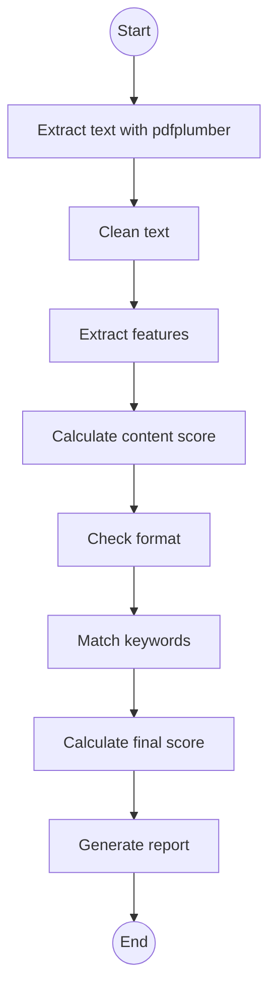

# Resume ATS Analysis Notebook

This Jupyter notebook provides a **comprehensive pipeline** to evaluate resumes in PDF format. It extracts text, cleans it, identifies key features, scores content and format, matches keywords against a job description, and generates a detailed report.

## Dependencies

This section installs and imports the required libraries to process PDFs, vectorize text, and compute similarities.

- pdfplumber: reliable text extraction from PDFs  
- PyMuPDF (fitz): PDF inspection (fonts, images, tables)  
- scikit-learn: TF-IDF vectorization and cosine similarity  
- numpy: numerical operations  

```bash
%pip install pdfplumber PyMuPDF scikit-learn numpy
```

```python
from sklearn.feature_extraction.text import TfidfVectorizer
from sklearn.metrics.pairwise import cosine_similarity
import numpy as np

import re
import pdfplumber
import fitz  # PyMuPDF
from collections import Counter
```

## Text Extraction

This stage reads all pages of a PDF and concatenates their text content.

### extract_text_from_pdf

Extracts raw text from each page using **pdfplumber**.

```python
def extract_text_from_pdf(pdf_path):
    text = ""
    with pdfplumber.open(pdf_path) as pdf:
        for page in pdf.pages:
            text += page.extract_text() or ""
    return text
```

## Text Cleaning

This step normalizes whitespace and lowercases all characters for uniform processing.

### clean_text

Removes extra spaces and converts text to lowercase.

```python
def clean_text(text):
    # Collapse whitespace and strip ends
    text = re.sub(r"\s+", " ", text)
    return text.strip().lower()
```

## Feature Extraction

Identifies key boolean features in the resume text (e.g., presence of email, phone, sections).

### extract_features

Searches for patterns and keywords to set flags.

```python
def extract_features(cleaned_text):
    email_pattern = r"[a-zA-Z0-9._%+-]+@[a-zA-Z0-9.-]+\.[a-zA-Z]{2,}"
    phone_pattern = r"\+?\d[\d -]{8,}\d"

    features = {
        "email": len(re.findall(email_pattern, cleaned_text)) > 0,
        "phone": len(re.findall(phone_pattern, cleaned_text)) > 0,
        "has_experience": "experience" in cleaned_text,
        "has_education": "education" in cleaned_text,
        "has_skills": "skills" in cleaned_text,
        "has_projects": "projects" in cleaned_text,
        "has_certifications": "certifications" in cleaned_text,
        "has_extracurricular_activities": "extracurricular activities" in cleaned_text,
        "has_summary": "summary" in cleaned_text,
        "has_metrics": bool(re.search(r'\d+%|\$\d+|[\d,]+\+', cleaned_text))
    }
    return features
```

**Extracted Features**

| Feature                          | Description                                        |
|----------------------------------|----------------------------------------------------|
| email                            | Detects an email address                           |
| phone                            | Detects a phone number                             |
| has_experience                   | Checks for “experience” section                    |
| has_education                    | Checks for “education” section                     |
| has_skills                       | Checks for “skills” section                        |
| has_projects                     | Checks for “projects” section                      |
| has_certifications               | Checks for “certifications” section                |
| has_extracurricular_activities   | Checks for “extracurricular activities” section    |
| has_summary                      | Checks for “summary” section                       |
| has_metrics                      | Finds percentages, dollar amounts, or plus counts  |

## Content Scoring

This function assigns weights to each feature and totals them for a **content score**.

### calculate_content_score

Computes a weighted sum based on feature presence.

```python
def calculate_content_score(features):
    feature_weights = {
        "email": 5,
        "phone": 5,
        "has_experience": 20,
        "has_education": 15,
        "has_skills": 15,
        "has_projects": 10,
        "has_certifications": 5,
        "has_extracurricular_activities": 5,
        "has_summary": 10,
        "has_metrics": 10
    }
    score = sum(feature_weights[k] for k, v in features.items() if v)
    return score
```

| Feature                        | Weight |
|--------------------------------|--------|
| email, phone                   | 5      |
| has_experience                 | 20     |
| has_education                  | 15     |
| has_skills                     | 15     |
| has_projects                   | 10     |
| certifications, extracurricular| 5 each |
| has_summary                    | 10     |
| has_metrics                    | 10     |

## Format Checking

Analyzes PDF structure (fonts, layouts, images) to compute a **format score** and list issues.

### check_format

Penalizes inconsistent fonts, images, tables, multi-columns, missing bullets, sections, or extreme lengths.

```python
def check_format(pdf_path, resume_text, cleaned_text):
    issues = []
    score = 100
    doc = fitz.open(pdf_path)

    # Fonts
    fonts, sizes = set(), []
    for page in doc:
        for block in page.get_text("dict")["blocks"]:
            if "lines" in block:
                for line in block["lines"]:
                    for span in line["spans"]:
                        fonts.add(span["font"])
                        sizes.append(span["size"])
    if len(fonts) > 3:
        issues.append("Inconsistent fonts - use max 1-2")
        score -= 10
    if len(set(sizes)) > 3:
        issues.append("Inconsistent font sizes - use max 2-3 sizes")
        score -= 5

    # Images
    for page in doc:
        if page.get_images():
            issues.append("Contains images (ATS may not read content)")
            score -= 15
            break

    # Tables
    for page in doc:
        if page.find_tables():
            issues.append("Contains tables (ATS may skip structured data)")
            score -= 10
            break

    # Columns
    for page in doc:
        x_positions = [b[0] for b in page.get_text("blocks")]
        if max(x_positions) - min(x_positions) > 300:
            issues.append("Multi-column layout detected (ATS may misread order)")
            score -= 10
            break

    # Bullet Points
    if not any(ch in resume_text for ch in ['•', '-', '*', '·']):
        issues.append("No bullet points used")
        score -= 10

    # Missing Sections
    required = ["experience", "education", "skills", "projects"]
    missing = [sec for sec in required if sec not in cleaned_text]
    if missing:
        issues.append(f"Missing sections: {', '.join(missing)}")
        score -= 10 * len(missing)

    # Length Check
    wc = len(cleaned_text.split())
    if wc < 300:
        issues.append("Resume too short")
        score -= 10
    elif wc > 2000:
        issues.append("Resume too long")
        score -= 10

    return issues, max(0, score)
```

**Format Checks & Penalties**

- Inconsistent fonts/sizes: −10, −5  
- Images: −15  
- Tables: −10  
- Multi-columns: −10  
- No bullets: −10  
- Missing sections: −10 each  
- Too short/long: −10  

## Keyword Matching

Matches technical keywords from a job description and computes **semantic similarity**.

### match_job_description

1. Extracts tech keywords via regex.  
2. Counts matches in resume.  
3. Computes TF-IDF cosine similarity.  
4. Returns a combined keyword score and matched list.

```python
def match_job_description(cleaned_text, job_description):
    if not job_description:
        return 0, []

    jd_clean = re.sub(r"\s+", " ", job_description).strip().lower()
    tech_pattern = (
        r'\b(?:python|sql|power bi|azure|aws|machine learning|'
        r'data analysis|excel|r|git|spark|hadoop|tableau|'
        r'tensorflow|pytorch|nlp|deep learning|statistics)\b'
    )
    tech_keywords = re.findall(tech_pattern, jd_clean)

    matches, count = [], 0
    for kw in set(tech_keywords):
        if kw in cleaned_text:
            matches.append(kw)
            count += cleaned_text.count(kw)

    # TF-IDF similarity
    try:
        vec = TfidfVectorizer()
        mat = vec.fit_transform([cleaned_text, jd_clean])
        sim = cosine_similarity(mat[0:1], mat[1:2])[0][0]
    except:
        sim = 0.0

    coverage = (len(matches) / max(len(set(tech_keywords)), 1)) * 50
    semantic = sim * 50
    score = min(100, coverage + semantic)
    return score, matches
```

## Final Score Calculation

Weights the three sub-scores into an **overall score** out of 100.

### calculate_final_score

```python
def calculate_final_score(content_score, format_score, keyword_score):
    final = (0.4 * content_score) + (0.3 * format_score) + (0.3 * keyword_score)
    return round(final, 2)
```

## Report Generation

Compiles all results into a **readable report** with recommendations.

### generate_report

```python
def generate_report(total_score, content_score, format_score,
                    keyword_score, features, format_issues, matched):
    report = []
    report.append("=" * 60)
    report.append("RESUME ATS ANALYSIS REPORT")
    report.append("=" * 60)
    report.append(f"\n📊 OVERALL SCORE: {total_score}/100")
    report.append(f"\n📋 Content Score: {content_score}/100")
    report.append(f"🎨 Format Score: {format_score}/100")
    report.append(f"🔑 Keyword Match: {keyword_score}/100")

    missing = [k.replace("has_", "").title() for k, v in features.items() if not v]
    if missing:
        report.append(f"\n❌ Missing Elements: {', '.join(missing)}")

    if format_issues:
        report.append("\n⚠️ Format Issues:")
        for issue in format_issues:
            report.append(f" • {issue}")

    if matched:
        report.append(f"\n✅ Matched Keywords: {', '.join(matched[:15])}")

    report.append("\n💡 Recommendations:")
    if total_score < 60:
        report.append(" • Improve resume quality significantly.")
    if not features.get("has_metrics"):
        report.append(" • Add metrics to achievements.")
    if not features.get("has_summary"):
        report.append(" • Add a professional summary.")
    if format_issues:
        report.append(" • Fix formatting issues.")
    if keyword_score < 50:
        report.append(" • Add more job-relevant keywords.")
    report.append("=" * 60)
    return "\n".join(report)
```

## Workflow Overview

This diagram visualizes the **end-to-end process** from PDF input to report output.



## Usage Example

Run the notebook as a script to prompt for inputs and display the report.

### Script Entry Point

```python
if __name__ == "__main__":
    pdf_path = input("Enter the full path of your resume PDF: ").strip()
    print("\nPaste the Job Description below (press Enter to finish):")
    job_description = input().strip()

    resume_text = extract_text_from_pdf(pdf_path)
    cleaned = clean_text(resume_text)

    features = extract_features(cleaned)
    content_score = calculate_content_score(features)

    format_issues, format_score = check_format(pdf_path, resume_text, cleaned)
    keyword_score, matched = match_job_description(cleaned, job_description)
    total = calculate_final_score(content_score, format_score, keyword_score)

    report = generate_report(total, content_score, format_score,
                             keyword_score, features, format_issues, matched)
    print(report)
```

```card
{
    "title": "Important Note",
    "content": "Ensure your PDF has selectable text. Scanned or image-only resumes may score poorly."
}
```

## Future Additions
 
- Introduce a GUI or web interface for non-technical users.
- Connect your frontend with your nlp model
- Try to add few more features (eg. resume creation)
- Expand keyword lists dynamically using job market data and embeddings. 
- Create a analytics section so that users can see the matchability of their jd with their resume
